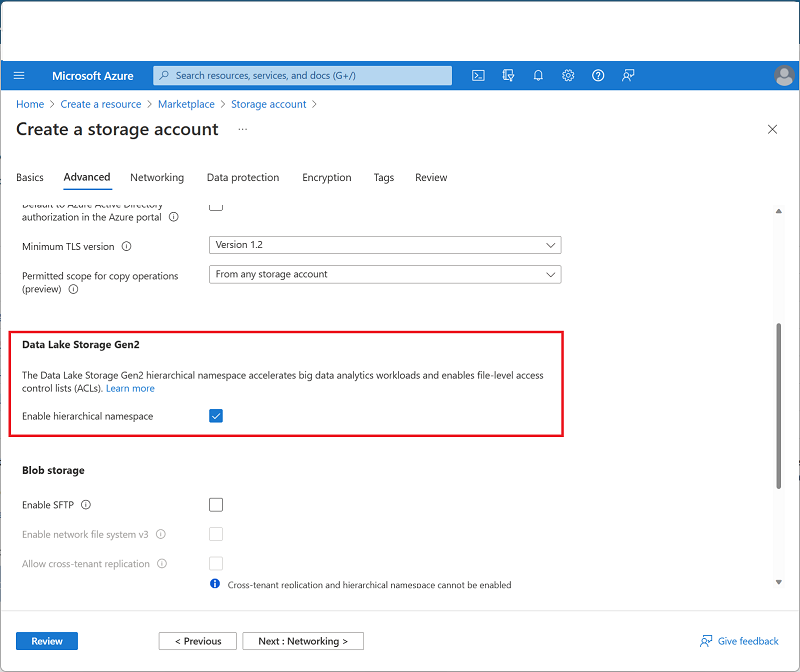
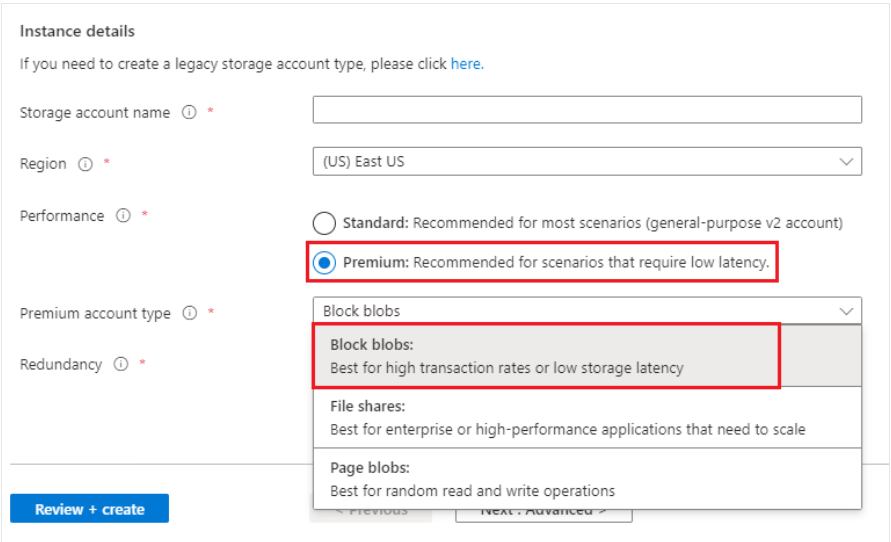
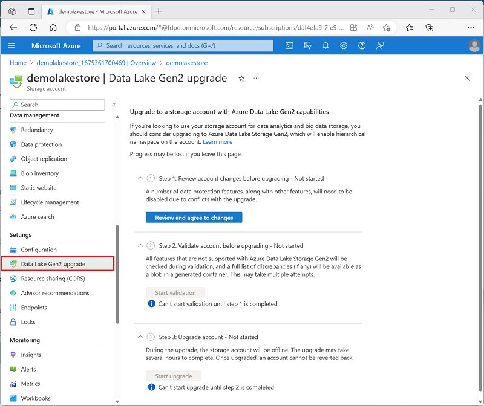

# Understand Azure Data Lake Storage Gen2

Over the past two decades, many organizations have concentrated on developing data warehouses and business intelligence (BI) solutions with relational databases. However, these traditional solutions often face Challenges when dealing with unstructured data due to high cost and complexity.

To overcome this issue, data lakes have become a popular alternative. A data lake is a storage system that allows organizations to store a wide range of data including structured, semi-structured and unstructured files. It leverages a distributed file system that can scala to accommodate vast amount of data, enabling organization to store data in its original form and later process and analyze it using technologies like Apache spark.

Azure Data alke Storage Gen2, a cloud-based solution from Microsoft Azure, is specifically designed for data Lake storage. It forms the foundation for many large scala analytics solutions built on Azure. By using Azure SData Lake Storage Gen2, Organizations can effectively store and manage their data lakes, unlocking the full potential of their data for analytics and insights.

## Why Azure Data Lake Storage

A Data Lake is a storage repository where data is kept in its raw, original form, such as files or blobs. Azure Data lake storage Provides a rebutting and cost-efficient solution within Azure for creating a data lake. It offers high scalability, advance security features and excellent performance, making it ideal for analytics. Specifically Designed to manege vast amounts of data even at an exabyte scale, Data Lake Storage supports both real time and batch processing, offering a versatile foundation for diverse data processing requirements.
 
## Hadoop Compatible access: 

Data Lake Storage is helpful because it allows you to interact with your data as if it's stored in the hadoop distributed files system(HDFS). This Enables you to keep all your data in one centralized location while using tools like Azure Databricks, Azure HHDInsight and Azure Synapse Analytics without needing to move the data. Additionally, you can use the parquet storage format which is space efficient and comfortable across different systems. Essential. It provides a convenient and seamless way to store and work with your data.

Security: Data lake Storage offers robust security features, including Support for access control lists (ACL's) and POSIX permission. These security settings can be configured using technologies like HIve and Spark, ot through tools such as Azure Storage Explorer.

Performance: Azure Data Lake Storage arranges your data using directories and subdirectories similar to a traditional file system. This structured hierarchy makes it easier to locate and manage data reducing computational overhead and saving both time and costs.

Data Redundancy: data lake Storage employs replication models to ensure data redundancy. Safeguarding your information. With locally redundant storage(LRS), your Data is copied within a single data center, protecting against localized failures. For greater protecting, Geo-redundant storage (GRS) replicates your data to a secondary region, ensuring approximately even in the event of a disaster or outage in the primary region.

# How to enable Azure Data Lake Storage.

Azure Data Lake Storage Gen2 is not an independent service within azure instead, it is a feature that can be enabled within a storage V2(General Purpose V2) Azure Storage account.
To activate azure data lake stage Gen2, select the enabled hierarchical namespace option on the advanced page while creating the storage account in the azure portal.

For step-by-step guidance, see [Create a storage account](https://learn.microsoft.com/en-us/azure/storage/common/storage-account-create?toc=%2Fazure%2Fstorage%2Fblobs%2Ftoc.json&tabs=azure-portal).

As you create the account, make sure to select the options described in this article.

Choose a storage account type.

## Enable the Hierarchical namespace:

Unlock Data lake storage capabilities by selecting the enabled hierarchical namespace setting in the advance table of the creation storage account page.

the Following image shows this setting in the creation storage account page

Data Lake Storage capabilities are supported in the following types of storage accounts:

- Standard General-purpose V2
- Premium block blob.

we can choose between these types of accounts in the basic tab of they create a storage **account** page.

To create a standard-purpose v2 account, select standard.

To create a premium block blob account, select premium. Then in the premium account type drop down list, select Block blobs.

if you already the Azure Storage account and want to enable the Azure data lake storage Gen 2 capabilities, you can use the data lake Gen2 upgrade wizard available on the Azure portal page for your storage account resource. this wizard will guide you through the process of upgrading your existing storage account to include Azure Data lake Storage Gen features.

## Azure Data Lake vs Azure Blob Azure Storage 

In Azure Blob storage, we can store large amounts of unstructured data, often referred to as 
"object" data within a blob container in flat namespace.
We can organize these blobs by using 
"/" character in their names to create virtual folders.
However, despite this organization, all blobs are still managed in a single-level hierarchy within the flat namespace.
Azure data lake storage Gen2 enhances this by introducing a hierarchical namespace allowing data to be
organized into directories.
This structure improves the efficiency of operations like renaming and deleting directories,
offering better performance for storage and retrieval in analytics tasks compared to flat namespaces,
which also helps reduce analysis costs.

In summary, if our goal is to store data without the need for analysis,
or if you are archiving data you can disable the hierarchical namespace option
and set up the storage account as a standard azure blob storage account.
This approach is useful for storing 
items like website assets, including images and media  or any data that doesn't require analysis.
On the other hand,
if we are planning to perform analytics on the data you should enable the hierarchical namespace option
to configure the storage account as an azure data lake storage Gen2 account.
Azure Data Lake Storage Gen2 integrated seamlessly with the Azure Storage platform, allowing 
application
to access the data
using with blob Apis or the Azure Data Lake Storage Gen2 file systems Apis
providing Flexibility and ease of access for analytics purpose.

# Conclusion.

In this article, we have delved into Azure Data Lake Storage Gen2, Covering everything from its activation process to its benefits and the key distinctions from Azure blob storage, we have highlighted the significance of enabling he hierarchical namespace and upgrading existing Azure Stoage accounts to full 
leverage the capacities of Azure data Lake Storage Gen2.

By recognizing the advantages of Azure Data Lake Storage Gen2,
such as its seamless integration with compute technologies and its support for an efficient storage mechanism, you can now make well-informed decisions
about managing and analyzing large datasets.

i hope this article has offered valuable insights and information.
we invite you to share your thoughts and experiences in the comments below.
your feedback is highly values as we continue to provide informative and useful content.