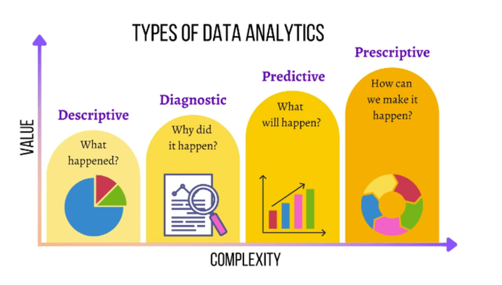
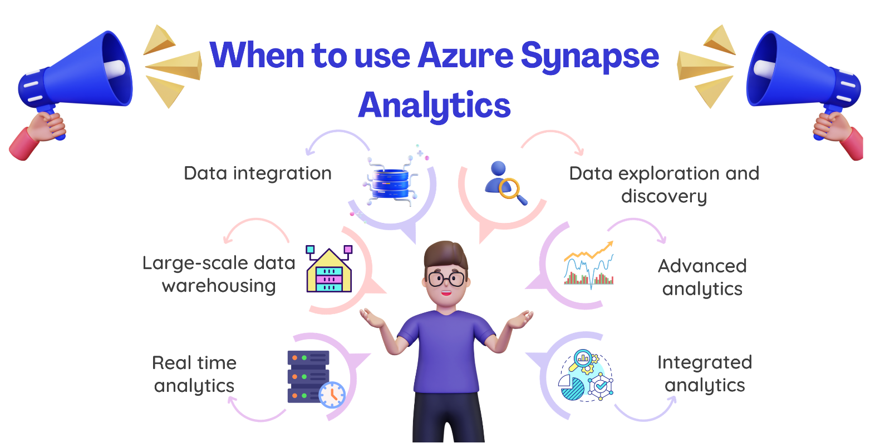

# Azure Synapse Analytics: A Step-by-Step Guide

In this article, we will explore Azure synapse Analytics and examine how it addresses various business challenges. We will dive into the core capabilities of azure synapse analytics, helping you identify scenarios where it can be effectively used. Whether you are a data professional, business analyst or IT decision maker, this article aims to provide valuable insights into the power and potential of azure Synapse analytics. Let's dive in and discover how this robust analytics service can transform your data driven initiatives.

### What is Azure Synapse Analytics.
    
Before diving deep into [Azure Synapse analytics](https://azure.microsoft.com/en-us/products/synapse-analytics#:~:text=Azure%20Synapse%20Analytics%20is%20an,log%20and%20time%20series%20analytics), let's first explore the different types of iof analytical techniques. This foundational knowledge will provide us with a deeper understanding of how azure Synapse analytics operates.

## Types of Analytical Techniques   

There are four common types of analytical techniques: Descriptive Analytics, Diagnostic Analytics, Predictive Analytics and Prospective Analytics. Let's dive into each one to explore their unique characteristics and applications.

### Descriptive Analytics: 
    
It answers the question of `what is happening?` It involves exploring data to gain insights and provides an overview of key performance indicators. This type of analytical allows us to examine data and understand its current state and trends.

### Diagnostic analysis:
    
It answers `why it is happening?` It goes beyond descriptive analytics to dive deeper into the data, uncovering the reasons behind insights and their impact on KPIs.

### Predictive analysis:

It answers the questions `what will happen?` it uses predictive models and data from previous analytical techniques to forecast future outcomes. By analyzing historical data patterns and trends, predictive analytics provides insights into potential refuter events or behaviors.

### Prescriptive analysis: 

it answers `what should i do?` it uses advanced techniques tro forecast future outcomes and offers valuable insights for making informed decisions.

Azure Synapse analytics offers a cloud-based platform that supports a variety of analytical workloads. It integrates multiple data storage processing and analysis technologies into a single cohesive solution. This enables organization to leverage their existing investments and experience in various data technologies, such as SQL and appcache Spark. With Azure Synapse Analytics, Users can manager and analyze data through a unified interface, simplifying the process of working with different data technologies ina centralized environment.

# How Azure Synapse Analytics Works

To meet the data analytics needs of modern organization, Azure Synapse Analytics provides a centralized service that manges both data storage and processing. Its adaptable architecture allows seamless integration of various data stores, processing platform and visualization tools through linkesd services.

## 1. Creating and using an Azure Synapse Analytics workspace

Synapse Analytics workspace serves as a container for managing the services and data resources needed for our analytics solution. You can create a workspace interactively via the azure portal ort automate the deployment using azure PowerShell, azure CLI or Azure resource manager templates.
Once our synapse analytics workspace is set up, we can use a synapse studio a web base portal to manager the services within it and perform data analytic tasks, Synapse offers as a user-friendly interface for working with Azure Synapse analytics.

## 2. Working with files in a data lake

In a synapse analytics workspace, one key resource is the data lake that allows you to store and process data files at scale. By default, the workspace comes with a data lake like to an Azure data lake storage Gen2 container. You can also add linked services for additional data lakes on different storage platforms as needed.

## 3. Ingesting and transforming data with pipelines

Azure Synapse analytics streamlines the data analysis process in enterprise solutions by offering built in support for creating, managing and running pipelines. These pipelines handle tasks such as collecting data from various sources, transforming it and storing the produced data for analysis. The pipelines in Azure synapse analytics use the same technology as Azure data factory. If we are familiar with Azure data factory, you can leverage your existing skills to create data ingestion and transformation solutions with in the Azure Synapse Analytic.

## 4. Querying and manipulating data with SQL

Azure Synapse Analytics supports SQL, a widely used language for querying and manipulating Data it offers two types of SQL pools:

### 1.Built in serverless pool

The Build in serverless pool in azure synapse analytics is optimized for querying and analyzing file-based data stored in data lake using SQL. It allows you to directly query data files without the need for pre-defined structure or dedicated compute resources. This pool offers a serverless and on demand approach, where you only pay for data processed during each query. It is suitable for ad-hoc analysis and processing of data in an efficient and cost-effective manner.

### 2.Custom dedicated SQl pools: 

Custom dedicated SQL pools are designed for histing relational data warehouses. Unlike the serverless pool, these pools require dedicated compute resources provisioned specifically for your workload. They provide more control for advance analytics, complex reporting and enterprise level data modeling. The cost for custom dedicated SQL pools is based on the provisioned resources and usage time. 

Azure Synapse SQL; uses a smart way to process SQL queries called distributed query processing. It breaks down the work into smaller parts and runs them simultaneously, making it faster and scalable for analyzing relational data. The build-in serverless pool is excellent for cost-effective analysis of data stored in data lake, allowing you to analyze data on demand without managing dedicated resources. Dedicated SQL pools are ideal for creating relational data warehouses, particularly for scenarios involving complex data modeling and reporting an enterprise setting.

## 5. Processing and analyzing data with Apache Spark

Apache spark is an open source platform designed for analyzing large datasets. It processes data distributed across multiple files in a data lake by executing jobs written in various programming languages like python, scala, java SQL and C#.
In Azure Synapse analytics you can create spark pools, which enables you to use interactive notebooks, these notebooks allow you to seamlessly integrate code and notes, making them particularly useful for developing solutions related to data analytics, machine learning and data visualization.

## 6. Exploring data with Data Explorer

Azure Synapse Data Explorer, a component aof azure Synapse Analytics, is a data processing engine that uses the Azure data explorer service. It employs a user-friendly query language known as Kusto Query Language to facilitate fast and real time analysis of both bath and streaming data with minimal delay 

## 7. Integrating with other Azure data services

Azure Synapse Analytics Seamlessly integrates with various Azure data services to deliver end to end analytics solutions.
These integrations include:

### 1. Azure Synapse link:

Enables near real time synchronization between operational data in Azure Cosmos DB, Azure SQL Database, SQL Server,
and Microsoft power platform Data verse, and analytical Data storage that can queries in Azure Synapse Analytics.

### 2. Microsoft Power BI Integration:

Allows data analyst to integrate a power BI workspace into a synapse workspace and perform interactive data visualization within Azure Synapse Studio.

### 3. Microsoft Purview integration: 

Enables organization to catalog data assets in Azure Synapse Analytics making it easier for data engineers to discover data assets and track data lineage when implementing data pipelines that ingest data into azure Synapse analytics.

### 4. Azure Machine Learning integration: 

Empowers data analysts and data scientists
to incorporate predictive model training and consumption directly into analytics solutions.

These integrations enhance the capabilities of azure synapse analytics,
providing a comprehensive and effective platform for data analysis and insights.

## When to use Azure Synapse Analytics

Azure synapse analytics is a robust data analytics service
that integrates the functionality of both a data warehouse and a data lake,
offering a versatile solution dor organization of all sized.
It's particularly beneficial, for enterprise
managing large volumes of data from diverse sources, providing a unified platform for data exploration,
analysis and visualization.
The image below providing a unified platform for data exploration, analysis and visualization.
The image below highlights specific scenarios where azure synapse analytics can be effectively used.

### 1. Large-scale data warehousing

Data warehousing involves integrating various types of data, including big data,
to effectively analyze and report on it.
The goal is to gain insights and generate reports based on descriptive analytics,
regardless of the data’s location or structure.

### 2. Advanced analytics

Azure Synapse Analytics empowers organizations
to conduct predictive analytics by leveraging its built-in capabilities
and seamlessly integrating with other technologies like Azure Machine Learning.
This allows organizations
to harness the power of predictive modeling and analysis within the Azure Synapse Analytics environment.

### 3. Data exploration and discovery

Azure Synapse Analytics offers a serverless SQL pool feature that allows Data Analysts,
Data Engineers, and Data Scientists to easily explore data stored in your data estate.
This functionality facilitates tasks such as data discovery, diagnostic analytics, and exploratory data analysis,
providing valuable insights and understanding of your data.

### 4. Real-time analytics

Azure Synapse Analytics provides the capability to capture, store, and analyze data in real-time or near-real-time.
This is made possible through features like Azure Synapse Link,
which enables seamless synchronization of data,
and the integration of services such as Azure Stream Analytics and Azure Data Explorer.
These functionalities allow organizations to process and gain insights from data as it arrives,
facilitating real-time analytics and decision-making.

### 5. Data integration

With Azure Synapse Pipelines, you can bring in, configure, transform,
and deliver data for consumption by downstream systems.
This comprehensive data orchestration capability is specifically designed for components within Azure Synapse Analytics.
It streamlines the process of ingesting, preparing, modeling, and serving data,
ensuring seamless data flow and efficient utilization within the Azure Synapse Analytics environment.

### 6. Integrated analytics

Azure Synapse Analytics simplifies the process of integrating different analytics services into a single solution.
This eliminates the complexity of managing multiple systems
and allows you to spend more time on valuable data analysis tasks.
With Azure Synapse Analytics,
you can focus on deriving meaningful business insights
rather than dealing with the hassle of maintaining and setting up multiple systems.

## Conclusion

Azure Synapse Analytics is a comprehensive platform for data analytics,
designed to simplify complex operations by integrating various services.
It offers both cost-effective serverless and dedicated SQL pools for efficient analysis.
The platform seamlessly integrates with Azure data services such as Cosmos DB,
SQL Database, Power BI, Purview, and Azure Machine Learning.
Additionally,
it supports high-performance analysis through Azure Synapse Data Explorer and leverages Apache Spark for distributed data processing,
enabling predictive analytics and providing efficient data pipelines.

In summary,
Azure Synapse Analytics is a powerful tool
that streamlines data analytics by bringing multiple services together into a single platform.
This allows us to focus on analyzing data and gaining insights without the hassle of managing complex setups.
