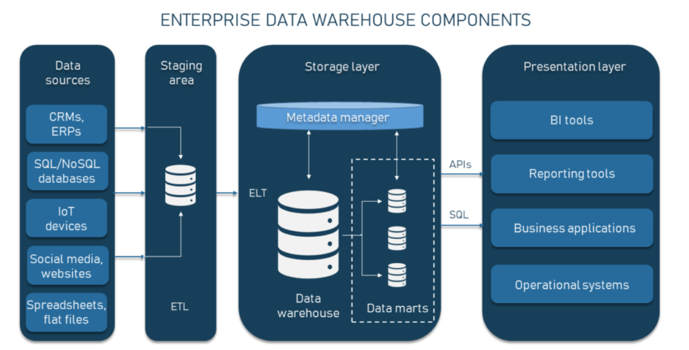

## Data Warehouse vs. Data Mart vs. Data Lake: Understanding Architecture and Use Cases

Data Warehouse, Data Mart and Data Lake are three fundamental structures in the landscape of data management, each serving a unique purpose and providing distinct advantages for handling vast amounts of data. This article explodes the details of each system, outlining their architectures, primary use cases, and the scenarios in which each is most beneficial.
 
By understanding these differences, organizations can make informed decisions about which systems align best with their operational needs and strategic goals, thereby optimizing their data handling capabilities for enhanced decision-making and operational efficiency.

## What is a Data Warehouse?

A data warehouse is a centralized repository designed to store integrated data from multiple heterogeneous sources. Data with in a warehouse is processed and structured for query and analysis supporting business intelligence activities.

### Data warehouse architecture 

A data warehouse is structured to organize and used large amounts of data efficiently. Below is a simple breakdown of each part of its architecture:

### Data Source Layer :

Purpose: this first layer collects data from various sources, such as company databases, customer relationship management systems, and enterprise resource planning (ERp) systems.

How it works; it consolidates different data across the organizations into one centralized location.

### Data Staging Area.

Purpose: Before the data can be used, it needs to be cleaned and standardized.

Process: this layer involved data preparation by cleaning (removing errors or duplicates). Transforming (modifying data formats and combining data different sources), and preparing it for storage usage.

### Data Storage Layer 

Purpose: Once the data is cleaned and organized, it is stored in this layer.

How data is stored: The data is maintained in a structure format within relational databases, facilitation, easier management and retrieval.

### Data Presentation layer 

Purpose: this layer organizes the data into understood and analyzable format for users.

Function: It summarizes and organizes the data tables charts or reports that are beneficial for business analysis.

### Access Tools

Purpose: These tools enable users to access and analyze the data stored in the data warehouse.

Tools Used Include business intelligence software, query tools and applications that assist users in retrieving and interesting the data.

# Data ware House architecture.

Architecture source [from](https://www.altexsoft.com/blog/enterprise-data-warehouse-concepts/)

In essence, a data warehouse collects data from various sources, cleans and organizes it, and then stores itr in a way that is easy to access and analyze. This structured approach helps businesses make informed decisions based on their data

## Data warehouse use cases.

Data warehouses serve as a powerful tool for managing and analyzing large amounts of organizational data. Below are some common use cases:

### Business Intelligence: 
 
Enhancing decision-making through comprehensive business intelligence tools.

### Reporting and analysis: 

Providing structured data for operational reporting and trend analysis.

### Data mining: 

Using sophisticated algorithms to discover patterns and relationships within the data.

### What is data Mart?

A data Mart is a subset of data warehouses, designed to cater to the specific needs for a particular business line or department. It is smaller. More focused and can be optimized for an essential subject or specialized function.

### Data Mart vs Data warehouse 

When comparing data marts to datastructures, its essential to understand their distinct roles and functionalities with in an organization's data strategy. Below is a detailed comparison of their differences in scope, performance and cost.

## Scope

### Data Mart: 

Serves a specific segment of an organization, such as a single department or team. It is designed to address particular problems or answer specific sets of questions relevant to its focused area. Data marts contain only the data necessary for their defined purpose, simplifying the data models and reducing the volume of data stored.

### Data Warehouse: 

Integrates data from across the entire organization, providing a comprehensive view of the enterprise. This broad scope supports wide-ranging, complex queries that cater to general reporting and decision-making needs at the organizational level. A data warehouse is built to handle large volumes of data from disparate sources, making it a central part of enterprise-wide data systems.

### Performance

## Data Mart: 
The focused nature of a data mart simplifies management and enhances performance. With a smaller dataset to query, response times are typically quicker, making data marts ideal for rapid, targeted insights. This is particularly beneficial for specific groups within the organization that require fast, frequent access to data.

## Data Warehouse: 

While data warehouses provide valuable insights, their large scale and complexity can lead to slower query performance, especially when handling very large datasets and complex queries across multiple data sources. Performance tuning and advanced data processing technologies are often needed to maintain speed and efficiency.

### Cost

## Data Mart: 

Implementing a data mart is generally less costly than setting up a full-scale data warehouse. The smaller scale of data marts means they require less hardware and software resources, and they are simpler to design and maintain. This makes data marts a cost-effective solution for departments with specific data needs that do not require the full complexity and breadth of a data warehouse.

## Data Warehouse: 

The cost of implementing and maintaining a data warehouse can be significantly higher. The integration of diverse data sources, along with the need for extensive storage capacity and powerful processing capabilities, increases the initial and ongoing expenses. Additionally, data warehouses often require a team of IT specialists to manage their operations and ensure data quality and consistency, which adds to the overall cost.

Understanding these distinctions helps organizations tailor their data management strategy to match their specific needs, balancing scope, performance and cost to achieve the most effective data handling solutions.

### Data Mart Architecture:
 A data Mart is like a smaller, specialized store of data that serves specific departments within an organization. Here's an easy-to-understand breakdown of its structure

## Source data:

### Purpose:

This component is where the data mart gets its information, pulling data either from different internal departments within the company or from external data sources.

### How it works:

The data gathered is specific to the needs of a particular department or business function. 

## Integration layer:

### Purpose: 

Before the data can be used effectively, it needs to be cleaned and standardized.

### Process: 

This layer focuses on ensuring the data is accurate and consistent by removing errors, flinging mismatched data from different sources and transforming iit into a format that can be easily used in the data mart.

### Storage:

### Purpose:

This is where the prepared data is kept.

### How data is stored:

It is usually stored in a relational database format, which organizes the data into tables and, makes it easy to manage and retrieve.

### Presentation 

### Purpose:

Data Needs to be presented in a wat that is useful and accessible to its users.

### Function:

This final Layer tailors the data presentation toi the specific requirements of its users such as departmental managers or analysts. It could be in the form of reports, dashboards or visual analytics that helps users make decisions based on the data.

In summary, a data mart provided a focused view of data for specific areas of an organization, ensuring that data is collected, cleaned, selected and presented in ways that are most useful to its intended users.

## Data Mart Use cases:

Data Marts are specialized tools that address the specific needs of a individual departments within an organization, enabling targeted analysis and reporting. Here are some common use cases for data marts:

### Departmental analysis:
 
Facilities deep specialized analysis for specific departments.

### Quick Deployment: 

It Can be quickly deployed to address urgent analytical needs.

### Cost Efficiency : 

Provides a cost effective solution for small-scale BI implementations.

