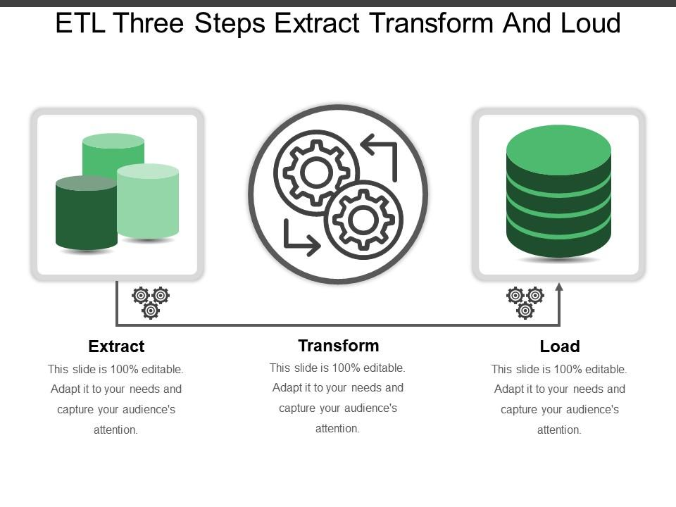
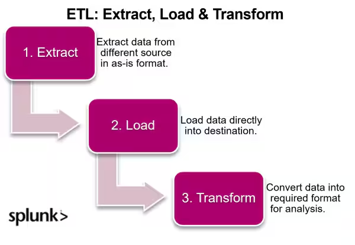

### ETL vs. ELT: Comprehensive Guide to Their Differences, Evolution, & Use Cases

Data is now central to the operations of many businesses, making data integration a critical challenge to address. For data engineers, much of their work involves moving data through pipelines, typically categorized as either ETL or ELT. While ETL has long been the standard for pipeline management, the advent of cloud technology is shifting the balance towards ELT.

This article explores the differences between ETL and ELT, tracing their evolution and identifying their unique applications. By the end, you'll have a clearer understanding of which approach best suits our needs.

## Difference in ETL vs ELT 

In data integration, ETL and ELT are two pivotal methods for transferring data from one location to another.

ETL (Extract, Transform, Load) is a traditional methodology where data is transformed using a separate processing server before being moved to the data warehouse.

ETL in 3 Steps

On the other hand, ELT (Extract, Load, Transform) is a more recent approach where raw data is directly transferred to the data warehouse, and transformations occur within the warehouse itself, bypassing the need for intermediary staging processes.

ETL vs. ELT
The primary difference between ETL and ELT hinges on the location of data transformation. In the ETL process, data is extracted from its source and then transformed externally on a separate processing server before being loaded into the data warehouse. This method ensures that only processed and refined data enters the data warehouse, leaving raw data outside its confines.

Conversely, ELT takes a slightly different route. With ELT, data is first extracted from its origin and loaded directly into the data warehouse in its raw form. It’s only after this loading step that the data undergoes transformation, all of which occurs inside the data warehouse itself. As a result, ELT retains both the raw and transformed versions of data within the warehouse, providing a richer historical context that can be invaluable for certain business intelligence applications.

This fundamental difference in the location of data transformation leads to several other distinct characteristics and implications for both ETL and ELT.

Here's a comprehensive side-by-side comparison table to highlight these nuances:

|Category|ETL (Extract, Transform, Load)	|ELT (Extract, Load, Transform)|
|------------|---------------|----------------|
|Definition|	Transforms data using a separate processing server before transferring it to the data warehouse.|	Directly transfers raw data to the data warehouse, where transformations occur within the warehouse.
|Order of Operations|	Extract → Transform → Load	|Extract → Load → Transform
|Processing Environment|	Transformation occurs on a dedicated server or intermediate system.	|Transformation occurs directly within the data warehouse.
|Data Latency|	Higher latency due to transformation before loading.|	Typically lower latency as data is loaded first, with transformations scheduled later.
|Flexibility|	Offers a more controlled transformation process.	|Provides agility and adaptability, especially in modern data warehouses.
|Complexity|	Can be complex for intricate data integrations.|	Simpler loading process but may require robust warehousing tools for complex transformations.
|Use Cases|	Ideal for legacy systems, smaller datasets, and high data security needs.|	Best suited for cloud-based environments and diverse data types (structured/unstructured).
|Speed|	May be slower due to the staging and transformation processes.	|Faster initial loading; transformation speed varies depending on warehouse capabilities.
|Privacy|	Enhanced data security due to controlled transformation processes.|	Data privacy depends on warehouse security measures; raw data is directly loaded.
|Maintenance	|Requires maintenance of the ETL server and transformation processes.|	Primarily focused on maintaining the data warehouse and its transformations.
|Cost|	Can be higher due to the need for dedicated servers and transformation tools.	|Costs are primarily related to data warehousing; can be lower with cloud-based solutions.
|Data Volume|	Suitable for smaller to medium-sized datasets.	|Ideal for handling larger volumes of data, leveraging the scalability of modern warehouses.

### ETL to ELT Evolution

The [origins of ETL](https://www.datanami.com/2019/09/03/can-we-stop-doing-etl-yet/) trace back to the early days of data warehousing, when there was a need to consolidate and standardize data from various sources. As technology and business needs evolved, the processes surrounding data integration and transformation also progressed, leading to the emergence of ELT as a complementary approach to ETL.

### Understanding ETL's Origins

In the late 1970s and 1980s, as the concept of data warehousing began to take shape, the need for a structured method to populate these warehouses led to the emergence of ETL. During this period, businesses increasingly relied on databases, many of which operated in isolation. This created a demand to consolidate scattered data for more comprehensive analysis.

As the data landscape evolved, becoming increasingly complex with a multitude of sources and formats, the need for a standardized data integration process became more pressing. This standardization paved the way for ETL processes, which were designed to extract data from diverse sources, transform it into a consistent format, and subsequently load it into a unified data repository.

### Drawbacks of ETL:

However, the industry soon realized that performing data transformations during the ETL process could lead to several challenges:

### Expensive to Implement and Maintain:

ETL is not simple to set up. Implementing it can take months, often requiring ongoing adjustments. The complexity of ETL systems frequently necessitates hiring specialists to manage and maintain them.

### Rigid in Nature:

ETL processes are highly structured. Data transformations occur in a staging area between the source and destination, which ensures consistency in data format but also limits the ability to process large volumes of data quickly. Additionally, ETL requires analysts to predetermine how they intend to use the data, which can lead to complications if the format needs to change.

### Slow to Provide Fresh Data:

ETL is slow when it comes to delivering fresh data. Since data transformations occur before loading, the process is less agile in handling today’s fast-paced data influx. Often, ETL operations are scheduled to run overnight, meaning that analysts do not have access to real-time data.

### Low in Visibility:

ETL only allows users to see the transformed and loaded data, not the raw data. This limited visibility can lead to misinterpretations, especially if the data is significantly altered during transformations.

### The Shift to Cloud

Over time, as cloud computing and big data technologies became, more prevalent, the traditional ETL paradigm began to evolve. The cloud's immense compute power and storage capabilities, combined with the increasing volume and velocity of data, led to the emergence of ELT (Extract, Load, Transform), where transformations are handled directly within the data warehouse. This evolution marked the beginning of the ETL vs. ELT debate.

This shift towards ELT was further driven by the rise of modern, cloud-native data warehouses such as Snowflake, BigQuery, Azure, and Redshift. These platforms provided the scalability and performance needed to handle transformations on massive datasets after they had been loaded.

## Advantages of ELT

With modern, fast data cloud warehouses, data professionals can now perform transformations directly within the warehouse. The advantages of ELT include:

### Agility: 

Similar to how software engineers deploy multiple times per day under the principle of continuous delivery, ELT enables data transformations to be implemented quickly. Changes to input data or metric definitions can be addressed in hours, not weeks or months.

### Scalability:

ELT leverages cloud storage and decreased reliance on on-site storage, allowing transformations to occur at the end of the process, which facilitates virtually endless scalability.

### Decision-making Centric: 

Modern data warehouses are designed for extensive data storage and analysis. With ELT, analysts don’t need to prematurely decide on reports or schema. The data warehouse serves as a consolidated hub, allowing analysts to work with genuine, unaltered data.

## How to Decide When to Use ETL vs. ELT

Data integration is crucial for businesses to derive insights, support decision-making, and streamline operations. Both ETL and ELT play essential roles, but their application varies based on specific use cases and requirements.

Since the ETL vs. ELT distinction can still be confusing, here's a comprehensive guide to help determine which approach is best suited for your needs:

## ETL and ELT Use Cases:

|Use Case|	ETL	|ELT|
|-----|----|----|
|Legacy Systems	|ETL fits seamlessly with older systems that may not be equipped to handle on-site data transformations, offering a dedicated transformation process.|	Cloud-based and advanced warehousing solutions like Snowflake or BigQuery can fully leverage ELT’s potential, performing transformations after data loading.|
|Smaller Datasets|	ETL is efficient when dealing with smaller data volumes that require intricate transformations.|	ELT can swiftly handle vast amounts of data by leveraging the scalability of modern warehouses.|
|High Data Security Needs|	The structured and controlled nature of ETL’s transformation process can enhance security, especially when handling sensitive data.	|ELT supports near-real-time analytics by enabling faster initial data loading and on-the-go transformations.|
|Diverse Data Sources|	When integrating data from multiple disparate sources, ETL’s transformation phase can harmonize and cleanse data before loading.|	ELT’s flexibility caters to both structured and unstructured data, allowing analysts to shape data as needed.|

## Guiding Data Teams in Their Choice:

|Criteria	|ETL|	ELT|
|---|-----|----|
|Assess Infrastructure|	More appropriate for organizations primarily using legacy systems.|	More suitable for modern, cloud-based infrastructures.
|Data Volume and Velocity|	Best for smaller or moderate data volumes and slower data influx.|	Favored for larger and faster data influxes, leveraging scalability of modern data warehouses.|
|Security Concerns	|Provides additional reassurance for data privacy and security through a controlled transformation process.|	Data privacy depends on warehouse security; transformations occur after data is loaded, which may affect initial security.|
|Transformation Complexity|	Better suited for complex and multifaceted transformations requiring a dedicated transformation phase before loading.	|Ideal for simpler, on-site transformations that can be handled directly within the data warehouse.|
|Cost Implications|	May involve higher costs due to the need for dedicated transformation servers and tools.	|Potentially lower costs with cloud-based solutions, as transformations are performed within the existing data warehouse.|

### Conclusion

In conclusion, both ETL and ELT provide distinct advantages, making it crucial for data teams to select the approach that best aligns with their specific needs, infrastructure, and long-term data objectives. By carefully considering the pros and cons of each method and understanding their unique use cases, organizations can establish a foundation for efficient and insightful data integration.