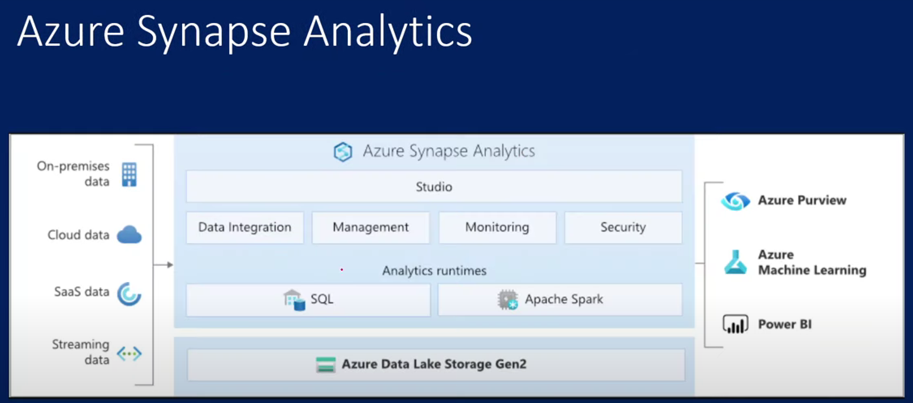

## Azure Synapse analytics:

Azure it is one of the analytical services it will be brought in data warehouse analytics and big data to one stop.

ADF-- is a service to perform etl operations using ETL pipelines

ADB -- azure data bricks it processes to load the data into bigdata.

ADLS -- Azure data lake storage, which is one type of storage for bigdata.

SQL DW -- and finally  it will load the data into data warehouse.

ETL -- Extract transform load.

ELT -- Extract load transform.

from SQL DW we take it and use those for data visualization using power BI etc., to showcase before leadership and all the above process is called as the Azure synapse analytics.

Azure Synapse analytics has the deep integration with Power BI, Cosmos DB and Azure ML.

 

Azure Synapse is a limit less analytics service that brings together enterprise data warehousing and big data analytics It gives you the freedom to query 
data on your terms using either serverless or dedicated resources -- at scale.

Azure Synapse analytics bring best of the below components together as single service 

    SQL technologies used in data warehousing (Synapse SQL).

    Spark technologies used in Big data (Apache Spark).

    Pipelines for data integration and ETL/ELT(ADF).

Synapse SQL:
	
#How to create Azure Synapse Analytics workspace.

    portal.azure.com to login and create the Dl.

    Synapse analytics can also login via web.azuresynapse.net and then navigate to the right synapse account and load it.

Basic concepts of Azure Synapse Analytics:

    - Synapse Workspace:

        - Is a collaboration place where we can perform cloud based enterprise analytics in azure.

        - Single workspace where all the data engineers and data scientists work as well.

        - It will be associated with ADLS gen2 and file system.

        - perform analytics with sql and apache spark.

        - Resource available for SQL and Spark analytics are organized into sql and Spark pools.

    - Linked Services:

        - It is a connection strings where synapse analytics can work with external storage account.

    - Synapse SQL :

        - Ability to run tSQL 

    - Apache Spark for Synapse :

    - Pipelines

Normalization:
    - it is easier to understand. 

    - it is enhanced and extend.

    — protect from 

        - inserting anomalies.

        - update anomalies.

        - deletion anomalies.

1st normal form

    - using row order to convey information is not permitted

    - Mixing data types within the same column is not permitted.

    - Having a table without a primary key is not permitted.

    - repeating groups are not permitted.

2nd Normal form.

    - partial dependency is not permitted. ex: if a table is made up with a composite key 

    - (primary key made up of more than one column) non non key attributes should depend on just a part of this composite key.
    - below is the example of 2NF as it ha two tables with one table having composite primary key as (courseID and IInstructor ID) and other table has Instructor ID as a primary key 

| CourseID	  | InstructorID  |
|------------|---------------|
|101	|1|
|102	|2|
|103	|1|

Table 2: 

Instructor

|InstructorID	| InstructorName	 |Department|
|------------|-----------------|------------|
|1	| Dr. Smith       |	Math|
|2| 	Dr. Jones      |	Physics|

3rd NF: also called as boyce-codd normal form:

    - every attribute in a table should depend on the key, the whole key and noting but the key.

4NF: 
    - Multivalued dependencies in a table must be multivalued dependencies on the key.

5th Normal form

    - the table which must be in 4NF cannot be describable as the logical result of joining some other tables together.

Data base Terminologies:
    
    - Entity  
        
        - An Entity is a specific real world thing or idea that we wish to represent and keep data about. for instance, students, professors, courses and department might all be considered entities in a university database.

    - Attribute
        
        - An attribute is a represnetation of a particular quality or trait of an entity. it outlines the information about the entity that we wish to store. A student entity, for instance may include  characteristic like a student ID, name, date of birth and major.
    
    - Key 
        
        - A key is an entity or an entity instances particular set of properties that uniquely identify it. for data intergrity and effecctive data retrieval, keys are necessary. To ensure that each student has a distinct identification, the student ID, for instance may act as the primary key in the student object.

    - Table
        
        - A relational database systems core structure for organizing data into rows and columns is a table. each table is made up of columns(attributes)  and rows(records), and it represnts a single entity. for instance a table called students may have columns for student data such as students ID nmae and mjor.
    
    - Primary Key:
    
        - A primary key is a way for a table to be uniquely identified. it guatantees that each row in the table can be identified individually. A single column or a group of columns might server as the primary key. The Student ID column for instance may server as a primary key in th estudents database.
    
    - Foreign Key:
        
        - A column or a group of columns in one database taht relates to the primary key in another table is known as a foreign key. as it creates connections between those tables. 
    
    - Relational Database:
    
        - It is kind of database system that arranges information into tables and uses keys to create relationships between those tables. Ii created a systamatic and effective method of managing data by adhering to the fundamentals of the relational model. Most popular relational datbase systems include PostgresSQL, Oracle, MySQL.

    - Query:
    
        - Requesting data or information from a database is known as a query.

    - Index:

        - A darabase tables index is a type of data structure that accelerated data retrival process.

    - Normalization:
        
        - Normalization is the process of arranging data in a daabase to reduce duplication and strengthen data integrity. It entails breaking down tables and crating connectiosn between them.

    - ACID:

        - Atomicity, Consistency, Isolation, and Durability or simply ACID are charactersitcs that gurantee the dependability and integrity of databse transactions. A transactions is always seens as a single peice of work.

    - Surrogate key:
        - 
Slowly changing Dimensions:

        - there are three primary types of SCD's 
        - Star Schema 
            - we have facts and dimensions. 
        these are Dimensions that change over time and they dont have fixed part.

Standard SCD's

        SCD 0: if there is a change in the source system, we dont chnage them in the data ware house. (no Change)
below is the example 
|------------|-----------------|------------|------|
|CustomerID	|Name	|City	|State|
|------------|-----------------|------------|------|
|1	|John Doe	|New York	|NY|
|2	|Jane Smith	|Los Angeles|	CA|
|3	|Emily Davis|	San Francisco|	CA|

        SCD 1: we maintain latest snapshot and we dont maintain any history.
        SCD 2: if there is any change in the data source system it will be as latest but it will updated in another row in data warehouse with date anf flag column.

    